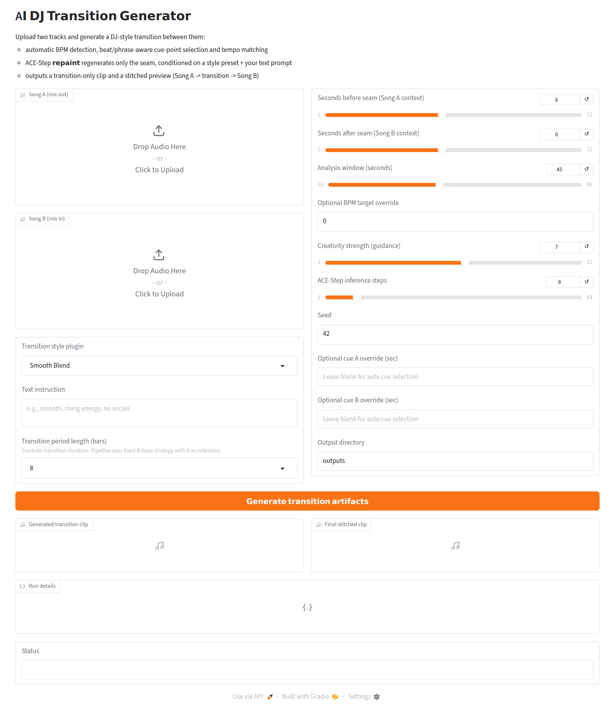
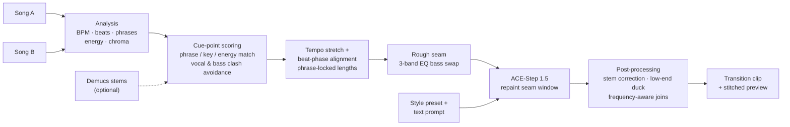

# AI DJ Transition Generator

[](https://github.com/shenzi418/ai-dj-generator/actions/workflows/ci.yml)

[](LICENSE)

Give it two songs and it generates a **DJ-style transition** between them. A signal-processing front end works out *where* and *how* to mix (tempo, beats, phrases, vocal/bass clashes). A generative music model (**ACE-Step 1.5**) then re-imagines only the seam, guided by a style preset and a free-text prompt.

This started as my MSc Generative AI course project. The idea is to *refine* a single foundation model into a domain-specific tool with musically meaningful controls, instead of relying on raw prompting.

<!-- TODO: add a link to a live demo / short video and 2-3 before/after audio samples here -->

<p align="center"></p>

## What it does

1. **Upload** Song A (outgoing) and Song B (incoming) in the Gradio app, or pass them to the CLI.
2. **Analyse** both tracks: BPM, beat grid, phrase positions, energy, key (chroma) and, optionally, Demucs stems.
3. **Pick cue points** by scoring candidate A-out / B-in pairs for musical compatibility.
4. **Tempo-match and phase-align** Song B to Song A, then build a rough DJ mix of the seam (EQ-style bass swap).
5. **Repaint the seam** with ACE-Step. Only the transition window is regenerated and the surrounding context is kept.
6. **Export** a transition-only clip plus a stitched preview (`…Song A → transition → Song B…`), along with a JSON report of every decision the pipeline made.

## How it works



### Technical highlights

- **Multi-factor cue-point selection** (`pipeline/cuepoint_selector.py`). It generates beat-aligned candidates near the end of Song A and the start of Song B and scores every pair on energy, phrase position, key similarity (chroma cosine), onset strength and structural section. When Demucs is available it adds stem-aware "mixability" signals: vocal activity, drum anchoring, bass stability and arrangement density. The strongest weights go to penalising **vocal-on-vocal and bass-on-bass overlap** across the whole transition period, which are the classic ways a mix sounds muddy. It falls back from structure-aware to scored to beat-based selection, and manual cue overrides always take precedence.
- **Musically quantised timing.** Transition length is specified in **bars** (4/8/16). Context windows are snapped to whole beats/phrases, half/double-tempo detections are resolved against the reference BPM, and Song B is phase-aligned to Song A's beat grid, using its drum stem when available.
- **DJ-style rough mix.** Before any generation, the seam is built the way a DJ would do it on a mixer: highs and mids crossfade early while the low end is handed over late, so the kick and bass never double up.
- **Generative refinement with ACE-Step `repaint`.** The rough mix is passed as `src_audio`, and only the seam window is regenerated. A reference clip (accompaniment-only by default) steers timbre, and a caption is built from a style preset plus the user's instruction.
- **Post-repaint correction.** Stem-level correction near the boundaries, low-frequency ducking inside the transition and frequency-aware crossfades back into the original songs keep the generated audio anchored to the real tracks.
- **Reproducible and inspectable.** Output filenames are a hash of every generation parameter, the seed is fixed, and each run returns a detailed JSON report (BPMs, stretch rate, chosen cues and their score breakdown, alignment offsets, window lengths).

### Style presets

| Preset | Caption sent to the model |
| --- | --- |
| Smooth Blend | smooth seamless DJ transition, balanced energy, clean, no vocals |
| EDM Build-up | energetic EDM build-up transition with rising tension, clean, no vocals |
| Percussive Bridge | percussive bridge transition with rhythmic drums and clear groove, no vocals |
| Ambient Wash | ambient wash transition, spacious and atmospheric, soft energy curve, no vocals |

Any free-text instruction is appended to the preset caption.

## Getting started

### Requirements

- Python **3.11** (required by ACE-Step)
- `ffmpeg` and `libsndfile` on the system path (`packages.txt`)
- A CUDA GPU is strongly recommended. ACE-Step also runs on Apple Silicon (MLX) and, slowly, on CPU.

### Install

```bash
git clone https://github.com/shenzi418/ai-dj-generator.git
cd ai-dj-generator
python3.11 -m venv .venv && source .venv/bin/activate

pip install -r requirements.txt
pip install git+https://github.com/ACE-Step/ACE-Step-1.5.git
```

The first run downloads the ACE-Step checkpoints, which takes a while.

### Run the web app

```bash
python app.py
```

Then open the local Gradio URL, upload two tracks, choose a preset and click **Generate transition artifacts**.

### Run from the command line

```bash
python -m pipeline.transition_generator \
  --song-a path/to/song_a.mp3 \
  --song-b path/to/song_b.mp3 \
  --plugin "EDM Build-up" \
  --instruction "rising energy, keep the hi-hats" \
  --transition-bars 8 \
  --seed 42 \
  --output-dir outputs
```

This writes `outputs/<stem>_transition.wav` and `outputs/<stem>_stitched.wav` and prints the JSON run report. Run with `--help` for all options, including manual cue/BPM overrides.

### Python API

```python
from pipeline import TransitionRequest, generate_transition_artifacts

result = generate_transition_artifacts(
    TransitionRequest(song_a_path="a.mp3", song_b_path="b.mp3", plugin_id="Smooth Blend", seed=42)
)
print(result.transition_path, result.details["cue_points_sec"])
```

### Configuration

| Environment variable | Default | Purpose |
| --- | --- | --- |
| `AI_DJ_ACESTEP_MODEL_CONFIG` | `acestep-v15-turbo` | ACE-Step model config |
| `AI_DJ_ACESTEP_DEVICE` | `auto` | Device for ACE-Step |
| `AI_DJ_ACESTEP_PROJECT_ROOT` | `/data/acestep_runtime` if writable, else `./.acestep_runtime` | Where checkpoints are stored |
| `AI_DJ_ENABLE_DEMUCS_ANALYSIS` | `1` | Stem-aware cue scoring |
| `AI_DJ_ENABLE_DEMUCS_TRANSITION` | `1` | Stem-aware alignment, bass handoff and post-correction |
| `AI_DJ_DEMUCS_MODEL` | `htdemucs` | Demucs model name |
| `AI_DJ_DEMUCS_DEVICE` | `cuda` (falls back to CPU) | Device for Demucs |
| `AI_DJ_REFERENCE_AUDIO_MODE` | `accompaniment-only` | Reference clip for ACE-Step (`accompaniment-only` or `full-period-a`) |

Demucs only runs on short analysis windows, not full tracks. Disabling it makes the pipeline fall back to the pure-DSP heuristics.

### Deploying to Hugging Face Spaces

Create a Gradio Space on GPU hardware and push `app.py`, `pipeline/`, `requirements.txt` and `packages.txt`. Add ACE-Step to `requirements.txt` (the commented line at the bottom). Checkpoints are cached under `/data` when persistent storage is enabled. The app is built for **user uploads**, so don't commit copyrighted audio to the Space.

## Project structure

```
.
├── app.py                         # Gradio UI
├── pipeline/
│   ├── transition_generator.py    # End-to-end pipeline, ACE-Step integration, CLI
│   ├── cuepoint_selector.py       # Candidate generation and cue-pair scoring
│   └── audio_utils.py             # Decoding, BPM/beat tracking, fades, resampling
├── tests/                         # Unit + integration tests (no GPU / model needed)
├── docs/PROJECT_PLAN.md           # Original design plan and roadmap
├── requirements.txt               # Runtime dependencies
├── requirements-dev.txt           # Test/lint dependencies
└── packages.txt                   # System packages for HF Spaces
```

## Development

```bash
pip install -r requirements-dev.txt
ruff check .
pytest
```

The test suite covers the DSP utilities, the timing/quantisation logic and a full run of the analysis stage (BPM detection → cue selection → tempo matching → rough seam) on synthetic audio. It doesn't need torch, Demucs or ACE-Step, so it runs in CI on every push.

## Limitations

- Cue selection is heuristic and can pick poor points on unusual structures. Manual cue and BPM overrides are available for those cases.
- Time-stretching is capped at 0.7×–1.35×, and large tempo gaps produce audible artefacts.
- Generation is GPU-bound. The first run is slow while checkpoints download.
- Output is mono at 32 kHz.

## Roadmap

- [ ] Config-driven style presets (`plugins.yaml`) with optional per-style LoRA adapters
- [ ] Fine-tune a transition-specific ACE-Step LoRA on licensed / royalty-free material
- [ ] Systematic evaluation: rule-based crossfade baseline vs. generative transition across a fixed set of song pairs
- [ ] Stereo output and loudness (LUFS) matching

See [`docs/PROJECT_PLAN.md`](docs/PROJECT_PLAN.md) for the original design and evaluation plan.

## Acknowledgements

- [ACE-Step 1.5](https://github.com/ACE-Step/ACE-Step-1.5), the music generation foundation model
- [Demucs](https://github.com/facebookresearch/demucs) for source separation
- [librosa](https://librosa.org/) for audio analysis
- [Gradio](https://www.gradio.app/) for the web UI

## License

[MIT](LICENSE). Model weights and third-party libraries are covered by their own licenses.
